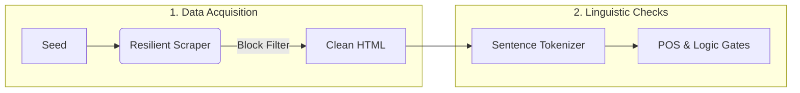
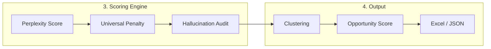

# ORYX: Market Intelligence Engine
[](https://github.com/saifmb0/oryx/releases/latest)


**ORYX** is an enterprise-grade search intelligence platform optimized for the UAE and Gulf markets. Unlike generic SEO tools, ORYX integrates local geography, bilingual intent (Arabic/English), and the semantic nuances of B2B contracting.

It extends traditional keyword research into **Generative Engine Optimization (GEO)**—optimizing content for citation by AI models such as Gemini, ChatGPT, and Perplexity.

## System Architecture

The ORYX pipeline is divided into two main stages: **Data Processing** (Ingestion & Validation) and **Intelligence Generation** (Scoring & Reporting).

### Stage 1: Data Processing Pipeline

This stage focuses on acquiring raw data and stripping away navigation noise and "Franken-keywords."


Stage 2: Intelligence & Scoring Engine
Once data is validated, it enters the scoring engine where it is ranked for naturalness, intent, and commercial value.

Key Features
1. Deep Localization
ORYX utilizes a custom Named Entity Recognition (NER) system populated with over 200 UAE-specific entities.

Districts: Mussafah, ICAD, KIZAD, Mohammed Bin Zayed City.

Regulatory Bodies: TAMM, Estidama, DED, Tawtheeq.

Legal Frameworks: Musataha, Freehold, Leasehold.

2. High-Precision Anti-Hallucination
To ensure data integrity, the system employs a multi-layer verification process (v3.2.0):

Sentence Boundary Detection: Uses NLTK to prevent navigation menus and footers from merging into incoherent phrases.

Semantic Logic Gates: Enforces business logic (e.g., preventing "buy" intent for service-based entities like contractors).

Perplexity Scoring: Uses sentence-transformers to reject unnatural or machine-generated phrasing by measuring semantic distance from natural query patterns.

3. Generative Engine Optimization (GEO)
The system analyzes content for "Information Gain" and "Trust Signals" (E-E-A-T), prioritizing keywords and topics likely to be cited by Large Language Models.

Installation
Prerequisites
Python 3.9 or higher

Virtual Environment (recommended)

Setup
```Bash

git clone [https://github.com/saifmb0/oryx-engine.git](https://github.com/saifmb0/oryx-engine.git)
cd oryx-engine
python -m venv .venv
source .venv/bin/activate
pip install -e ".[all]"
Usage
Basic Execution
Run the pipeline with the default configuration.
```
```Bash

oryx run --seed-topic "turnkey villa construction" --geo ae
Market-Specific Presets
```

Load specialized configurations for specific verticals. The following example targets the Abu Dhabi contracting sector:
```Bash

oryx run \
  --seed-topic "commercial fit out" \
  --preset presets/contracting_ae.yaml \
  --geo ae \
  --output "strategy_report.xlsx"
```
Configuration
ORYX is highly configurable via config.yaml or preset files. Key configuration sections include:

Scrape: Controls timeout, retries, and proxy rotation settings.

NLP: Defines n-gram ranges and document frequency thresholds.

Cluster: Adjusts the sensitivity of the semantic clustering algorithm.

GEO: Sets target region, primary emirate, and bilingual processing modes.

Contributing
Please read CONTRIBUTING.md for details on our code of conduct and the process for submitting pull requests.

License
This project is licensed under the GNU Affero General Public License v3.0. See the LICENSE file for details.