# Keyword Lab

[](https://github.com/your-org/keyword-lab/actions/workflows/test.yml)
[](https://www.python.org/downloads/)
[](https://opensource.org/licenses/MIT)

A simple CLI that turns a seed topic into a ranked list of long‑tail SEO keywords. It reads content, expands ideas, groups similar intents, estimates basic metrics (all on a 0–1 scale), and outputs a compact JSON list you can use immediately.

## Pipeline Overview

```mermaid
flowchart LR
    A[🌱 Seed Topic] --> B[📥 Sources]
    B --> C[🔤 NLP]
    C --> D[🎯 Cluster]
    D --> E[📊 Score]
    E --> F[📁 Output]
    
    B --> |URLs, Sitemap, Files| C
    C --> |Bigrams, Questions| D
    D --> |Intent, Similarity| E
    E --> |Opportunity Score| F
    
    style A fill:#e1f5fe
    style F fill:#c8e6c9
```



## What it does (in 1 minute)
- Start with a seed topic (e.g., "best coffee beans").
- Optionally point it at a folder of `.txt/.md` notes, URLs, or a sitemap.xml.
- It generates keyword candidates (bigrams/trigrams and questions), expands with an LLM (Gemini/OpenAI/Anthropic), clusters by similarity/intent, and scores them.
- You get a clean JSON array of ranked keyword ideas you can analyze or feed into dashboards.

## How it works (at a glance)
1) Acquire text
- Local notes, URLs, or sitemaps (visible text only, robots.txt respected).
- Optional: expand with LLM (set `GEMINI_API_KEY`, `OPENAI_API_KEY`, or `ANTHROPIC_API_KEY`).

2) Generate candidates
- Clean text, extract bigrams/trigrams with TF‑IDF & counts, auto-generate question forms, plus seed‑based expansions.

3) Cluster & tag intent
- Encode keywords and cluster (SBERT if available, else TF‑IDF). Tag intent with configurable rules (informational/commercial/transactional/navigational).

4) Score (0–1 scale)
- search_volume: normalized signal from prominence and question boost.
- difficulty: normalized signal from length/head‑term heuristics.
- opportunity_score: search_volume × (1 − difficulty) × business relevance.

5) Output
- JSON, CSV, or Excel (.xlsx) with one object per keyword, ranked by opportunity_score.

## What you get
Each item (all lowercase keyword/cluster):

- keyword: string
- cluster: string
- intent: informational | commercial | transactional | navigational
- funnel_stage: TOFU | MOFU | BOFU
- search_volume: 0–1 (estimated)
- difficulty: 0–1 (estimated)
- estimated: boolean
- opportunity_score: 0–1

Example (snippet):
```json
[
  {"keyword": "best coffee beans", "cluster": "cluster-1", "intent": "commercial", "funnel_stage": "MOFU", "search_volume": 0.72, "difficulty": 0.41, "estimated": true, "opportunity_score": 0.42},
  {"keyword": "how to dial in espresso", "cluster": "cluster-0", "intent": "informational", "funnel_stage": "TOFU", "search_volume": 0.66, "difficulty": 0.25, "estimated": true, "opportunity_score": 0.50}
]
```

## Installation

```bash
# Basic installation
pip install -e .

# With all optional features
pip install -e ".[all]"

# Or specific feature sets
pip install -e ".[ml]"     # SBERT embeddings
pip install -e ".[llm]"    # Gemini/OpenAI/Anthropic
pip install -e ".[excel]"  # Excel export
```

## Quick Start

```bash
# Interactive mode (prompts for topic and audience)
keyword-lab run

# With arguments
keyword-lab run --seed-topic "best coffee beans" --audience "home baristas"

# Output as table
keyword-lab run --seed-topic "espresso" --audience "beginners" --table

# Export to Excel
keyword-lab run --seed-topic "coffee" --audience "cafes" --output report.xlsx

# Analyze a competitor's sitemap
keyword-lab run --seed-topic "coffee" --sources https://example.com/sitemap.xml
```

## Features

| Feature | Description |
|---------|-------------|
| 🔤 **NLP Pipeline** | Bigrams, trigrams, TF-IDF, question generation |
| 🎯 **Smart Clustering** | SBERT or TF-IDF with optional Silhouette Score optimization |
| 🤖 **Multi-LLM Support** | Gemini, OpenAI, Anthropic via LiteLLM |
| 📊 **Multiple Outputs** | JSON, CSV, Excel with cluster summaries |
| 🗺️ **Sitemap Support** | Analyze competitor sites via sitemap.xml |
| ⚡ **Caching** | Fast iterations with URL caching |
| ⚙️ **Configurable** | YAML config for rules, settings, and behavior |

## Configuration

Copy `config.sample.yaml` to `config.yaml` and customize:

```yaml
# Customize intent detection
intent_rules:
  transactional:
    - buy
    - discount
    - demo  # Add your own triggers

# Enable smart cluster count
cluster:
  use_silhouette: true
  
# Choose LLM provider
llm:
  provider: auto  # auto, gemini, openai, anthropic, none
```

## Talking points (why this is useful)
- **Long‑tail focus**: Generates bigrams/trigrams and natural questions aligned to searcher intent.
- **Clusters by intent**: Helps you plan pillar pages vs. supporting content.
- **Simple, transparent scoring**: All metrics are 0–1 and marked estimated when inferred.
- **Clean output**: Minimal JSON array, easy to version, diff, and analyze.
- **Fast iterations**: Good defaults; bring your own notes or URLs; optional LLM expansion.

## Limitations & Ethics
- No paid SERP scraping; respects robots.txt best‑effort; avoids scraping Google HTML directly.
- Metrics are heuristic (estimated=true) unless you integrate a trusted provider.
- Language support is English‑first for stopwords, but it still runs for other languages.

## Contributing

See [CONTRIBUTING.md](CONTRIBUTING.md) for development setup and guidelines.

## License

MIT License - see [LICENSE](LICENSE) for details.
